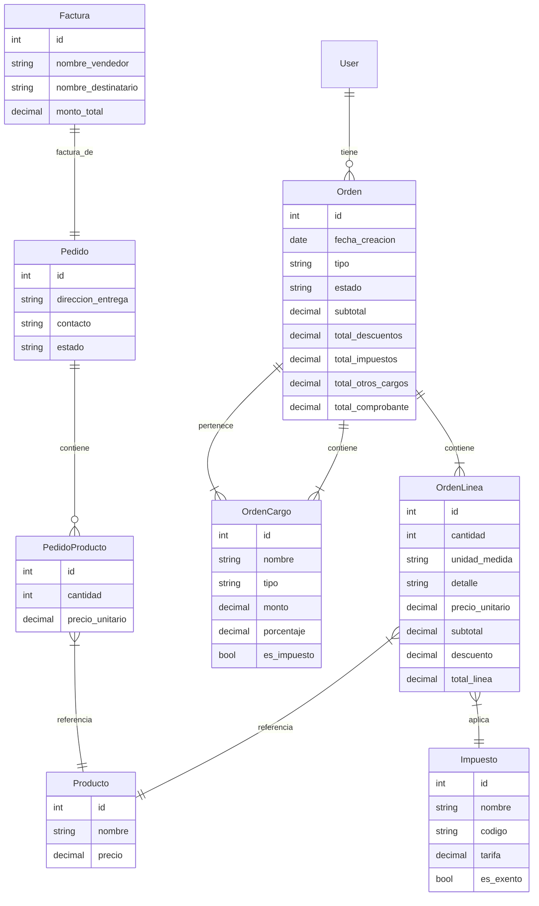
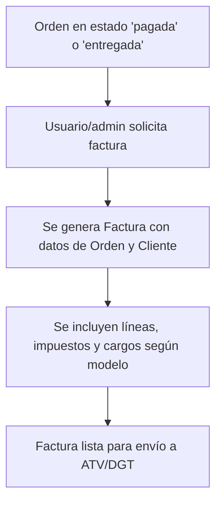

## 1. Mapa de sitio (sitemap)

**Navegación principal (top bar)**
- Dashboard  
- Productos  
- Pedidos  
- Facturación  
- Rutas  
- Informes  
- Configuración  

**Navegación secundaria (side drawer o sidebar según contexto)**
- **Dashboard**
  - Pedidos pendientes  
  - Pedidos en curso  
  - Mejores clientes  
  - KPIs de ventas  
- **Productos**
  - Lista de productos (∞ scroll, 6–8 tarjetas por “página”)  
  - Productos estrella  
  - Crear/modificar producto  
- **Pedidos**
  - Sala (mesero)  
  - Delivery (app cliente)  
  - Historial  
- **Facturación**
  - Pendientes por generar (in-situ)  
  - Generadas (automáticas)  
  - Configuración de impuestos (prorrata, exoneraciones)  
- **Rutas**
  - Vista mapa  
  - Asignar repartidor  
  - Seguimiento en tiempo real  
- **Informes**
  - Ventas por periodo  
  - Inventario  
  - Tiempos de entrega  
- **Configuración**
  - Roles y permisos  
  - Integraciones (pagos, ERP, TPV, mensajería)  
  - Idiomas y monedas  
  - Accesibilidad (WCAG AA)  

---

## 2. Flujo de navegación y pantallas clave

| Módulo            | Desktop                                               | Tablet / Móvil                                           |
|-------------------|-------------------------------------------------------|----------------------------------------------------------|
| **Dashboard**     | 3-columnas (cards KPIs, lista pedidos, gráfico de ventas) | 1-columna (cards apiladas, charts colapsables)          |
| **Productos**     | Sidebar + grid de tarjetas (imagen, nombre, precio) con ∞ scroll y skeleton | Drawer lateral + lista vertical con acciones swipe     |
| **Pedido Sala**   | Sidebar + form rápido (buscador, sugeridos arriba, variaciones) | Drawer para nav; “Add” fijado en footer + modal-cart    |
| **Pedido App**    | Hero “Productos estrella”, filtros, carrito lateral    | Tabs en footer + drawer lateral para categorías         |
| **Facturación**   | Tabla paginada + detalle en modal al click             | Lista de ítems; detalle en pantalla completa            |
| **Rutas**         | Mapa a la derecha + lista de entregas a la izquierda   | Mapa full-screen con drawer inferior para detalles      |

---

## 3. Estados y componentes comunes

- **Estado vacío**  
  - Mensaje (“No hay productos aún”) + CTA (“Crear producto”)  
- **Carga**  
  - Skeletons sobre tarjetas/listas  
- **Éxito/Fracaso**  
  - Modal centrado con título, mensaje y botón de acción  
- **Infinit Scroll**  
  - “Cargar más” automático al llegar al final; skeletons inline  
- **Gestos (móvil)**  
  - Swipe derecha para “Marcar entregado”  
  - Swipe izquierda para “Eliminar”  
- **Contraste & accesibilidad**  
  - Texto normal ≥ 4.5:1, botones/elementos ≥ 3:1  
  - Tamaño mínimo touch: ≥ 44 × 44 px  

---

## 4. Wireframes high-fi: primeros cinco bocetos

1. **Dashboard (desktop / tablet / móvil)**  
   - Top bar con logo, búsqueda global, perfil/idioma/moneda.  
   - Sidebar (tablet/desktop) o drawer (móvil).  
   - Cards de KPIs, tabla de pedidos, gráfico de ventas.  

2. **Listado de productos**  
   - Grid de tarjetas (imagen, nombre, precio, badge “estrella”).  
   - Infinit scroll con skeletons.  
   - Empty state con CTA.  

3. **Flujo “Crear producto” (formulario)**  
   - Campos: nombre*, categoría*, foto, precio*, descripción, stock opcional.  
   - Validaciones inline (regional Costa Rica).  
   - Botón “Guardar” en bottom bar (móvil) / modal (desktop).  

4. **Toma de pedido – Sala**  
   - Buscador + sugeridos arriba.  
   - Tarjetas de plato con foto y variaciones.  
   - Carrito lateral (desktop) / modal-cart (móvil).  

5. **Vista de facturación**  
   - Tabla de pedidos con estado de factura.  
   - Modal de factura con líneas de detalle, impuestos (prorrata, exoneraciones) y totales.  
   - Botón “Generar factura” (in-situ) o indicador automático.  

---

## 5. Próximos pasos

1. **Revisión**  
   - Validar sitemap y módulos de wireframe.  
2. **Bocetos**  
   - Preparar artboards high-fi para desktop, tablet y móvil.  
3. **Iteración**  
   - Ajustes de estilo: colores amigables, tipografías, iconos sugeridos (Feather, FontAwesome) y microcopy cercano.

---

## 6. Modelos y lógica de órdenes y facturación (backend)

### Modelos principales

- **Impuesto**: Define los impuestos aplicables a productos y líneas de orden, compatible con la facturación electrónica de Costa Rica (ATV 4.4). Permite múltiples tipos y tarifas.
- **TipoOrden**: Define los tipos de orden (ej: salón, para llevar, express) y permite asociar cargos e impuestos permitidos a cada tipo.
- **TipoCargo**: Define los tipos de cargo posibles (servicio, embalaje, transporte, etc.).
- **TipoOrdenCargo**: Relación entre TipoOrden y TipoCargo, indicando qué cargos están permitidos para cada tipo de orden.
- **TipoOrdenImpuesto**: Relación entre TipoOrden e Impuesto, indicando qué impuestos se aplican a cada tipo de orden.
- **Orden**: Núcleo de la lógica de ventas y facturación. Incluye cliente, tipo (ForeignKey a TipoOrden), estado, dirección/contacto, y todos los totales fiscales requeridos (subtotal, descuentos, impuestos, otros cargos, total comprobante). Relaciona líneas y cargos.
- **OrdenLinea**: Cada producto/servicio de la orden, con cantidad, unidad, detalle, precio, descuento, impuesto y total de línea. Cumple con los campos requeridos por la DGT/ATV.
- **OrdenCargo**: Permite agregar cargos adicionales (servicio, embalaje, transporte, otros) de forma flexible, afectando el total de la orden. Cada cargo referencia a un TipoCargo.
- **Factura**: Modelo para la información fiscal y legal de la factura electrónica, enlazada a un pedido.

### Lógica de asociación y validación

- En la configuración global, el usuario puede asociar qué tipos de cargo e impuesto están permitidos para cada tipo de orden.
- Al crear una orden, solo se pueden seleccionar cargos e impuestos permitidos según el tipo de orden.
- El backend valida que los cargos/impuestos asociados a una orden sean válidos para su tipo.
- El frontend muestra solo las opciones válidas según el tipo de orden.

### Ejemplo de flujo de configuración global

1. El admin define los tipos de orden (ej: salón, para llevar, express).
2. El admin define los tipos de cargo (servicio, embalaje, transporte, etc.).
3. El admin asocia, desde la interfaz de configuración, qué cargos e impuestos están permitidos para cada tipo de orden.
4. Estas reglas se usan luego en la creación y edición de órdenes.

### Lógica de cálculo y automatización

- El método `calcular_totales` en el modelo `Orden` centraliza el cálculo de todos los totales fiscales: subtotal, descuentos, impuestos, otros cargos y total comprobante.
- Se usan señales de Django (`post_save`, `post_delete`) para que cualquier cambio en líneas o cargos dispare automáticamente el recálculo de totales, garantizando integridad y cumplimiento fiscal.
- El modelo soporta fácilmente nuevos tipos de cargos, impuestos, promociones o reglas de negocio.

### Compatibilidad fiscal y extensibilidad

- Todos los campos y relaciones cumplen con los requisitos de la DGT/ATV 4.4 para facturación electrónica en Costa Rica.
- El sistema es robusto y flexible para distintos escenarios de venta, tipos de orden, cargos dinámicos y cambios futuros.

### Pruebas automáticas

- Se implementaron pruebas unitarias para verificar que los totales de la orden se recalculan correctamente al crear, modificar o eliminar líneas y cargos, usando el sistema de señales.
- Las pruebas cubren los casos de agregar, modificar y eliminar líneas, así como la adición de cargos.

---

## 7. Cambios recientes y mejoras

- CRUD de productos con carga de imagen y validación mejorada.
- Modelo de órdenes y facturación flexible, robusto y compatible con ATV 4.4.
- Serializers y admin para todos los modelos nuevos.
- Lógica centralizada y automática de recálculo de totales.
- Pruebas unitarias para la lógica de órdenes y señales.
- Reorganización de modelos y admin para evitar errores de registro y referencias circulares.

---

## 8. Diagrama del modelo de datos (Órdenes y Facturación)



**Notas:**
- Las relaciones reflejan la estructura real de la base de datos y los vínculos fiscales requeridos.
- El modelo es extensible para nuevos cargos, impuestos, promociones, etc.

---

## 9. Diagramas de flujo de procesos (Órdenes y Facturación)

### 9.1. Flujo de creación y actualización de una orden

```mermaid
flowchart TD
    A[Usuario crea/modifica Orden] --> B[Agrega/modifica OrdenLinea(s)]
    B --> C[Agrega/modifica OrdenCargo(s) opcionales]
    B & C --> D[Señales post_save/post_delete]
    D --> E[Llama a calcular_totales() en Orden]
    E --> F[Actualiza totales fiscales de la Orden]
    F --> G[Orden lista para facturación]
```

### 9.2. Flujo de generación de factura electrónica



---

## 10. Recursos de API recomendados para el modelo de órdenes y facturación

### Endpoints principales (REST, sugeridos)

- **/api/ordenes/**
  - `GET`: Listar órdenes
  - `POST`: Crear orden
- **/api/ordenes/{id}/**
  - `GET`: Detalle de orden (incluye líneas y cargos)
  - `PUT/PATCH`: Modificar orden
  - `DELETE`: Eliminar orden
- **/api/ordenes/{id}/lineas/**
  - `POST`: Agregar línea a orden
- **/api/ordenes/{id}/cargos/**
  - `POST`: Agregar cargo a orden
- **/api/ordenes/{id}/calcular/**
  - `POST`: Forzar recálculo de totales (opcional, normalmente automático)
- **/api/impuestos/**
  - CRUD de tipos de impuesto
- **/api/facturas/**
  - `GET`: Listar facturas
  - `POST`: Generar factura para una orden/pedido
- **/api/facturas/{id}/**
  - `GET`: Detalle de factura
  - `PUT/PATCH`: Modificar factura
  - `DELETE`: Eliminar factura

### Esquema de ejemplo para creación de orden (POST /api/ordenes/)

```json
{
  "cliente": 1,
  "tipo": "SALON",
  "lineas": [
    {
      "producto": 5,
      "cantidad": 2,
      "unidad_medida": "Unid",
      "detalle": "Arroz con pollo",
      "precio_unitario": 3500,
      "descuento": 0,
      "impuesto": 1,
      "total_linea": 3955
    }
  ],
  "cargos": [
    {
      "nombre": "Servicio",
      "tipo": "SERVICIO",
      "monto": 500,
      "es_impuesto": false
    }
  ]
}
```

### Respuesta de detalle de orden (GET /api/ordenes/{id}/)

```json
{
  "id": 123,
  "cliente": 1,
  "tipo": "SALON",
  "estado": "pendiente",
  "fecha_creacion": "2025-05-25T12:34:56Z",
  "subtotal": 7000,
  "total_descuentos": 0,
  "total_impuestos": 910,
  "total_otros_cargos": 500,
  "total_comprobante": 8410,
  "lineas": [
    {
      "id": 1,
      "producto": 5,
      "cantidad": 2,
      "unidad_medida": "Unid",
      "detalle": "Arroz con pollo",
      "precio_unitario": 3500,
      "subtotal": 7000,
      "descuento": 0,
      "impuesto": 1,
      "total_linea": 7910
    }
  ],
  "cargos": [
    {
      "id": 1,
      "nombre": "Servicio",
      "tipo": "SERVICIO",
      "monto": 500,
      "es_impuesto": false
    }
  ]
}
```

### Notas de integración
- Los totales se recalculan automáticamente en el backend, pero se puede exponer un endpoint manual de recálculo si se requiere para integraciones externas.
- Los endpoints de facturación deben validar que la orden esté en estado válido antes de generar la factura.
- Los modelos y endpoints están preparados para cumplir con la normativa fiscal costarricense y pueden adaptarse a cambios futuros.

---
